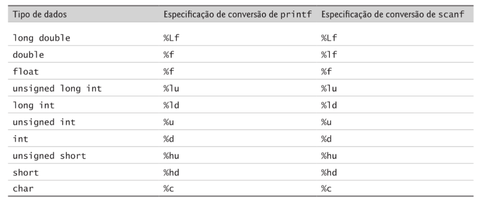

# Definição de funções em C

``` c
tipo_valor_retorno nome_da_função (lista_de_parâmetros){
    definições;
    instruções;
}
```

- O nome-função é qualquer identificador válido.
- O tipo-valor-retorno é o tipo de dado do resultado retornado à chamadora.
- O tipo-valor-retorno _void_ indica que uma função não retorna um valor.
- Juntos, tipo-valor-retorno, nome-função e lista de parâmetros às vezes são chamados de cabeçalho da função.
- Retornar um valor de uma função com um tipo de retorno void é um erro de compilação

## Lista de parâmetros

- É uma lista separada por vírgula que especifica os parâmetros recebidos pela função quando ela é chamada. Se uma função não recebe nenhum valor, a lista de parâmetros é _void_. Um tipo precisa ser listado explicitamente para cada parâmetro.

- __Erro comum:__
  - Especificar parâmetros de função do mesmo tipo como __double x, y__ em vez de __double x, double y__ . Resulta em erro de compilação.

- O protótipo da função, o cabeçalho e as chamadas de função deve combinar em número, tipo e ordem de argumentos e de parâmetros, e também no tipo do valor de retorno.

## Protótipo de função

- Um dos recursos mais importantes de C. O protótipo de função diz ao compilador o tipo de dado retornado pela função, o número de parâmetros que a função espera receber, os tipos de parâmetros e a ordem em que esses parâmetros são esperados. O compilador utiliza protótipos de função para validar as chamadas de função.
- Inclua protótipos de função em todas as funções para tirar proveito das capacidades de verificação de tipo da C.
Utilize diretivas do pré-processador #include para obter protótipos de função para as funções da biblioteca-pa-
drão a partir dos cabeçalhos para as bibliotecas apropriadas, ou para obter cabeçalhos que contenham protótipos
de função para funções desenvolvidas por você e/ou pelos membros do seu grupo.

- __Exemplo de prototipo no programa maximum.c:__

``` c
#include <stdio.h>

int maximum(int x, int y, int z);  /* prototipo de função */

int main(void) {
   
   int number1;
   int number2;
   int number3;

   printf("Digite três inteiros: ");
   scanf("%d%d%d", &number1, &number2, &number3); //&number* pode gerar erro de compilação
   
   printf("Máximo é: %d\n", maximum( number1, number2, number3));

   return 0;
}

int maximum(int x, int y, int z) {

   int max = x; /* considera que x é o maior */

   if (y > max){ 
      max = y;
   }
   
   if (z > max) {
      max = z;
   }

   return max;
} /* fim da função maximum */

```

- O protótipo de função é igual à primeira linha da definição da função.
- Às vezes, os nomes de parâmetros são incluidos nos protótipos de função para fins de documentação. O compilador ignora esses nomes.
- __Os valores de argumento de função são convertidos para tipos de parâmetro de um protótipo de função como se estivessem sendo atribuidos diretamente às variáveis desses tipos.__
- __Um protótipo de função colocado fora de qualquer definição de função se aplica a todas as chamadas para a função que aparecem após o protótipo de função no arquivo. Um protótipo de função colocado dentro de uma função se aplica apenas às chamadas  feitas nessa função.__
- __OBS__ : Esquecer de colocar ";" ao final de um protótipo de função é um erro de sintaxe.
- Uma chamada de função que não corresponde ao protótipo de função consiste em um erro de compilação. Outro erro também
é gerado se o protótipo de função e a definição da função divergirem.
- Outro recurso importante dos protótipos de função é a __coerção de argumentos__, ou seja, forçar os argumentos para o tipo apropriado.

## Tipos de dados em ordem do mais alto para o mais baixo

- E especificações para scanf, printf e hierarquia de promoção para tipos de dados:



- A conversão de valores em tipos inferiores normalmente resulta em um valor incorreto. Portanto, um valor pode ser convertido em um tipo inferior somente pela atribuição explícita do valor a uma variável do tipo inferior, ou usando-se um operador de coerção.
